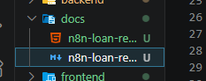

Use these values in the `loan_returned` email node in n8n.

`To`
`{{$json.body.email}}`

`Subject`
`Thank you for returning "{{$json.body.bookTitle}}" - KBC Library`

`Message`
Copy the HTML from:
[n8n-loan-returned-feedback-email.html](/abs/path/c:/Users/HP/OneDrive/Desktop/Book/docs/n8n-loan-returned-feedback-email.html)

Available webhook fields from the backend:
- `{{$json.body.name}}`
- `{{$json.body.email}}`
- `{{$json.body.phoneNumber}}`
- `{{$json.body.bookTitle}}`
- `{{$json.body.returnedAt}}`
- `{{$json.body.returnCondition}}`
- `{{$json.body.returnConditionNotes}}`
- `{{$json.body.loanId}}`
- `{{$json.body.copyNumber}}`
- `{{$json.body.feedbackToken}}`
- `{{$json.body.feedbackUrl}}`

Important:
- Use `{{$json.body.feedbackUrl}}` for the feedback button link.
- `feedbackUrl` is already generated by the backend.
- Make sure `FRONTEND_BASE_URL` in backend `.env` points to your real frontend domain.
